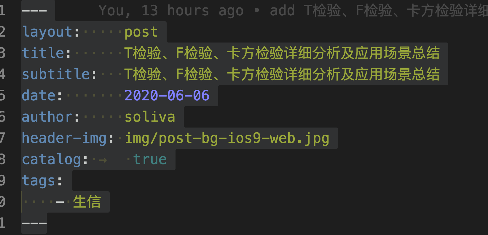

## TMB去除同意突变与非同义突变的差异
取样一组样本去重并且去除不合格样本后剩余427例样本
其中同意第一种使用非同义突变计算

数据取一个header，看看先

第二种使用同意突变计算，计算的相关性很好

做一个T检验
先看看是不是正态-目前看还算正态

统计TMB的结果高于cutoff与低于cutoff数量

结果Pvalue=1表示两个样本的均值相同
证明去除同义突变对结果是无影响的

